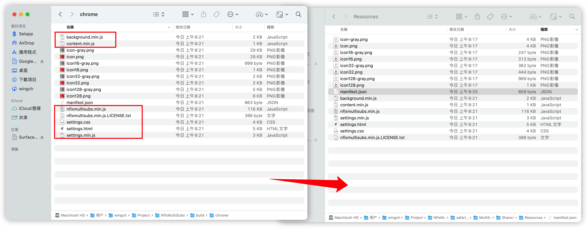

Build directories are `build/chrome` 

```
cd NflxMultiSubs
npm install
npm run build
```

Patch the settings code to work with Safari:

```
LC_ALL=C sed -i '.bak' 's/chrome\.runtime/browser.runtime/g' src/*.js && rm src/*.bak
```

If the xcode project has not been generated before,   use [converter](https://developer.apple.com/documentation/safariservices/safari_web_extensions/converting_a_web_extension_for_safari) to convert chrome extension to safari extension

```
xcrun safari-web-extension-converter --app-name MultiSubs --bundle-identifier com.wingch.MultiSubs --copy-resources build/chrome
```

If you have an existing xcode project and just want to update the js code

move following file from `/build/chrome` to `/xcode_project/Shared (Extension)/Resources`



update version number in `manifest.json` and xcode project

 